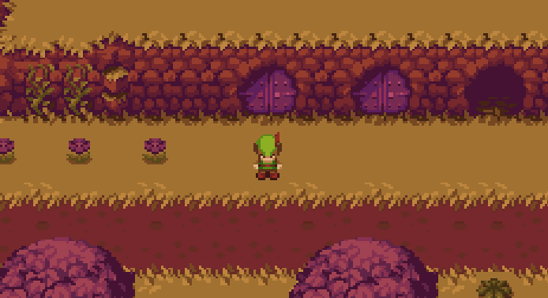

# Forest Adventure

Forest Adventure is a 2D game, currenly in a very early development stage. The title for this game is not settled yet, Forest Adventure is just a working name. It is currently available for Windows (x86).

## Building

The development is currently made by using Visual Studio 2019 [Community](https://www.visualstudio.com/vs/community/).

## Used Libraries

[SFML](http://www.sfml-dev.org/) : Cross-platform software development library

[Tiny XML](http://www.grinninglizard.com/tinyxml2/index.html) : XML parsing

## License

The source code of this repository is licensed under MIT license.

The PNG files found in the tiny-RPG-forest-files folder are licensed under CC0 v1.0 Universal license.

The TTF files found in the cello-sans folder are licensed under the SIL Open Font License, Version 1.1.

The TTF file found in the intuitive folder are licensed under the SIL Open Font License, Version 1.1.

## Credits

[ansimuz](https://ansimuz.itch.io/tiny-rpg-forest) : tiny-RPG-forest-files

[Alfredo Marco Pradil](https://fontlibrary.org/en/font/cello-sans) : cello-sans 

[Bruno de Souza Le„o ](https://fontlibrary.org/en/font/intuitive) : intuitive
